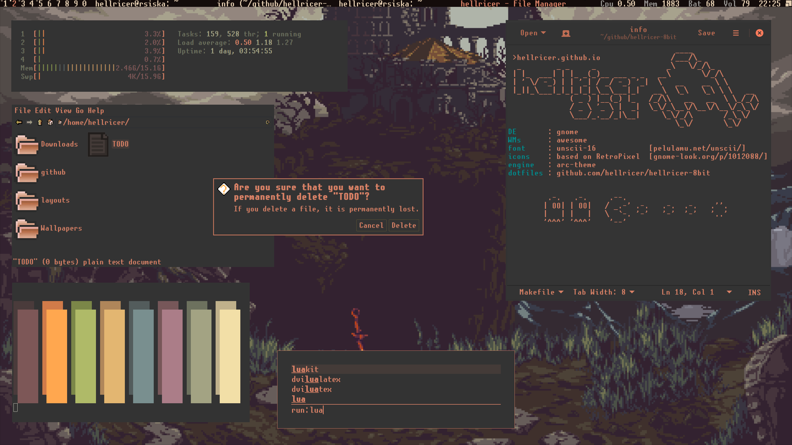

```
                                      ____
 >hellricer.github.io                /___/\_
  _        _ _     _                _\   \/_/\_
 | |_  ___| | |_ _(_)__ ___ _ _   __\       \/_/\
 | ' \/ -_) | | '_| / _/ -_) '_|  \   __    __ \ \
 |_||_\___|_|_|_|_|_\__\___|_|   __\  \_\   \_\ \ \   __
              ( _ ) |__(_) |_   /_/\\   __   __  \ \_/_/\
              / _ \ '_ \ |  _|  \_\/_\__\/\__\/\__\/_\_\/
              \___/_.__/_|\__|     \_\/_/\       /_\_\/
                                      \_\/       \_\/
DE       : gnome
WMs      : awesome
font     : unscii-16            [pelulamu.net/unscii/]
icons    : based on RetroPixel  [gnome-look.org/p/1012088/]
engine   : arc-theme
dotfiles : github.com/hellricer/hellricer-8bit


         .-.   .-.     .--.
        | OO| | OO|   / _.-' .-.   .-.  .-.   .''.
        |   | |   |   \  `-. '-'   '-'  '-'   '..'
        '^^^' '^^^'    '--'
```

